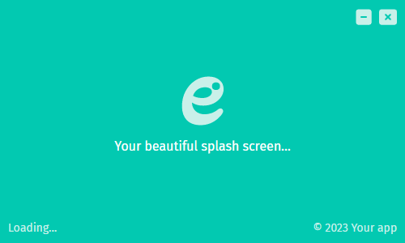
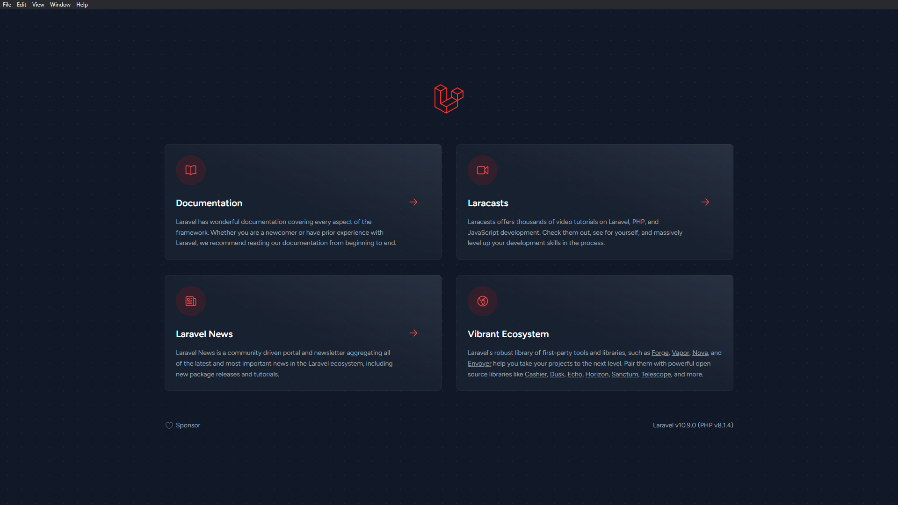

# Laravel and Electron Template Project

This project is a template for building desktop applications using Laravel 10 and Electron 24. 
It is inspired by the [laravel-electron](https://github.com/laravelarticle/laravel-electron) project, but 
updated to use the latest versions of Laravel and Electron.

## Features
- Built with Laravel 10, a popular PHP web framework
- Uses Electron 24 to package the Laravel application as a desktop application
- Slash Screen implementation
- Includes a basic script to build and package the application for Windows, macOS, and Linux platforms

## Getting Started
To get started with the template, you will need to have PHP, Node.js, and Yarn installed on your system. You can then follow these steps:

- Clone this repository: git clone https://github.com/mendela1992/laravel-10-electron.git
- Install PHP dependencies: composer install
- Install Node.js dependencies: yarn/npm install
- Build the frontend assets: yarn/npm run dev
- Start the Electron application: yarn/npm run electron

You should now see the example application running in the Electron window.

##Building and Packaging

To build and package the application for distribution, you can use the included script:

`yarn run build` This will build the frontend assets and package the application for Windows, macOS, and Linux platforms. The packaged applications will be located in the dist directory.

## License
This template project is open-sourced software licensed under the MIT license.

### Slash Screen

### Main Screen

